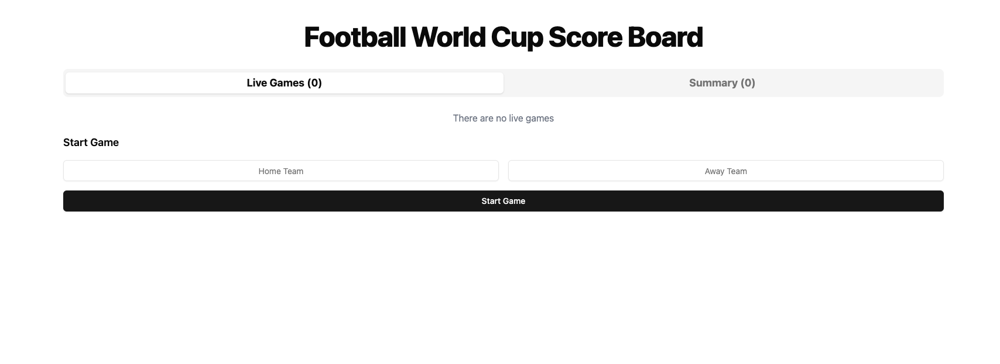
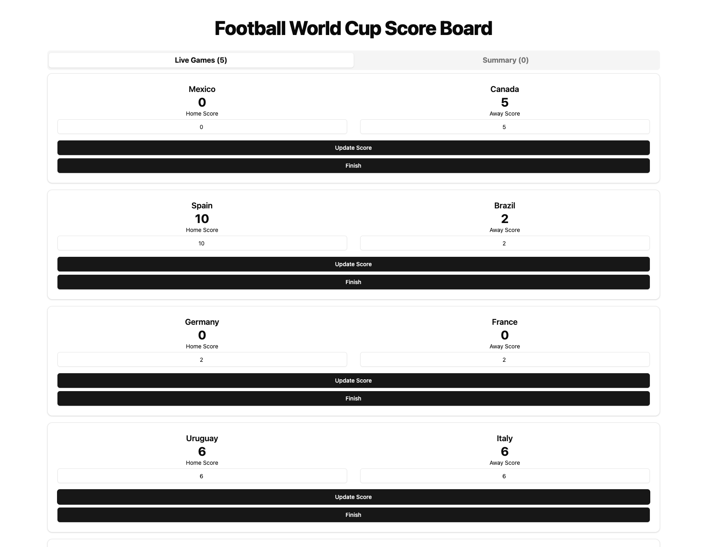
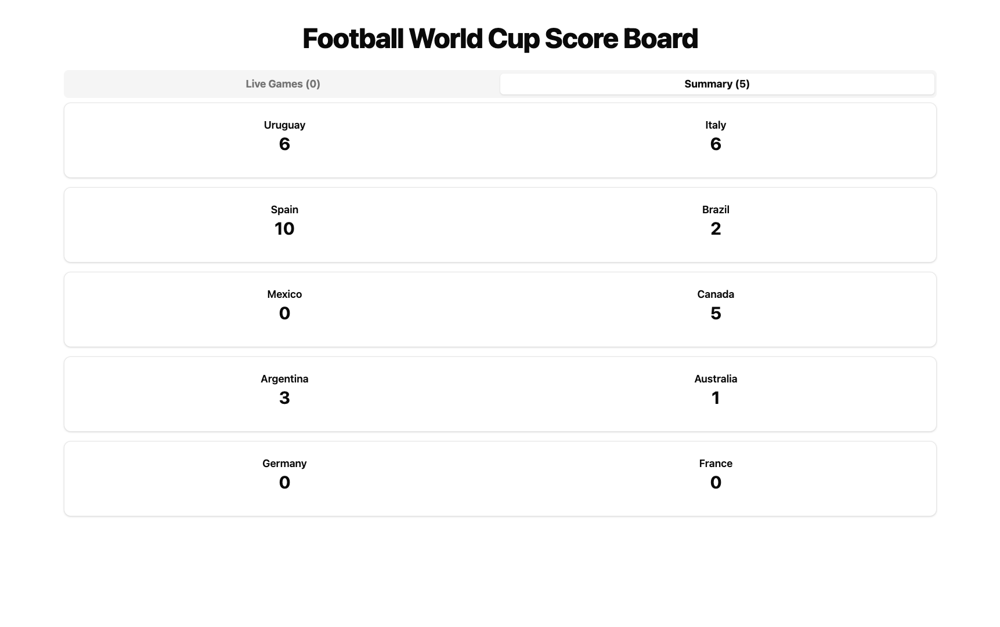
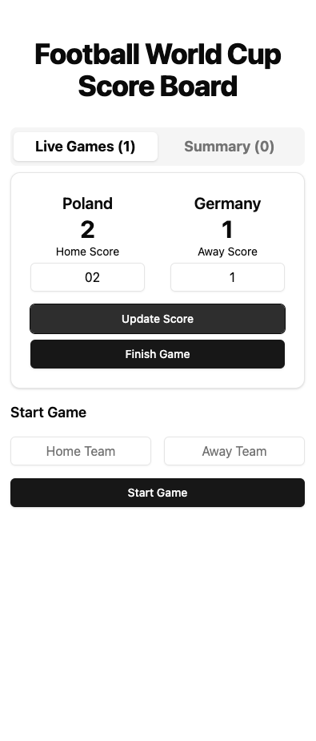

# Football World Cup Score Board

A TypeScript library implementation of a Football World Cup Score Board that allows starting games, updating scores, finishing games, and getting a summary of games by total score. The library is framework-agnostic and comes with a React-based demo application showcasing its usage.

## Tech Stack

- **Frontend Framework**: React 18
- **Language**: TypeScript
- **Styling**: TailwindCSS
- **Testing**:
  - Vitest
  - React Testing Library
  - Jest DOM
- **UI Components**:
  - Radix UI (Tabs, Slots)
  - Shadcn/ui (Cards, Buttons, Inputs)
- **Build Tool**: Vite
- **Package Manager**: npm/yarn

## Project Structure

```
src/
├── lib/ # Core business logic
│ ├── ScoreBoard.ts # Main scoreboard logic class
│ ├── ScoreBoard.test.ts # Tests for scoreboard logic
│ ├── types.ts # Type definitions
│ └── utils.ts # Utility functions
│
├── components/
│ ├── ui/ # Reusable UI components
│ │ ├── button.tsx
│ │ ├── input.tsx
│ │ ├── card.tsx
│ │ └── tabs.tsx
│ └── ScoreBoard/
│ ├── index.tsx # Main ScoreBoard component
│ ├── LiveGameCard.tsx
│ ├── SummaryGameCard.tsx
│ ├── useScoreBoard.ts
│ └── ScoreBoard.test.tsx # Component tests
│
└── App.tsx # Root component
```

## Architecture

The application follows a clear separation of concerns:

### Core Logic (`lib/ScoreBoard.ts`)

- Manages the game state
- Handles game operations (start, update, finish)
- Maintains score tracking
- Provides sorting and filtering capabilities

### UI Components (`components/ScoreBoard/`)

- Presents the scoreboard interface
- Manages user interactions
- Handles real-time updates
- Provides tab navigation between live games and summary

## Key Features

1. Start new games with initial 0-0 score
2. Update scores for live games
3. Finish games
4. View live games
5. View summary of finished games sorted by total score
6. Responsive design
7. Accessible UI components

## UI Overview

### Start Game Form



### Live Games View



### Summary View



### Mobile Responsive View



## Getting Started

1. Install dependencies:

```
npm install
```

2. Start the development server:

```
npm run dev
```

3. Run tests:

```
npm run test
```

## Testing

The project includes comprehensive tests for both:

- Business logic (ScoreBoard class)
- UI components (React Testing Library)

## Accessibility

The application is built with accessibility in mind:

- ARIA labels
- Keyboard navigation
- Screen reader support
- Semantic HTML

## Project Configuration

The project uses:

- TypeScript with strict mode
- ESLint for code quality
- Prettier for code formatting
- Vite for fast development and building
- Path aliases (@/) for clean imports
